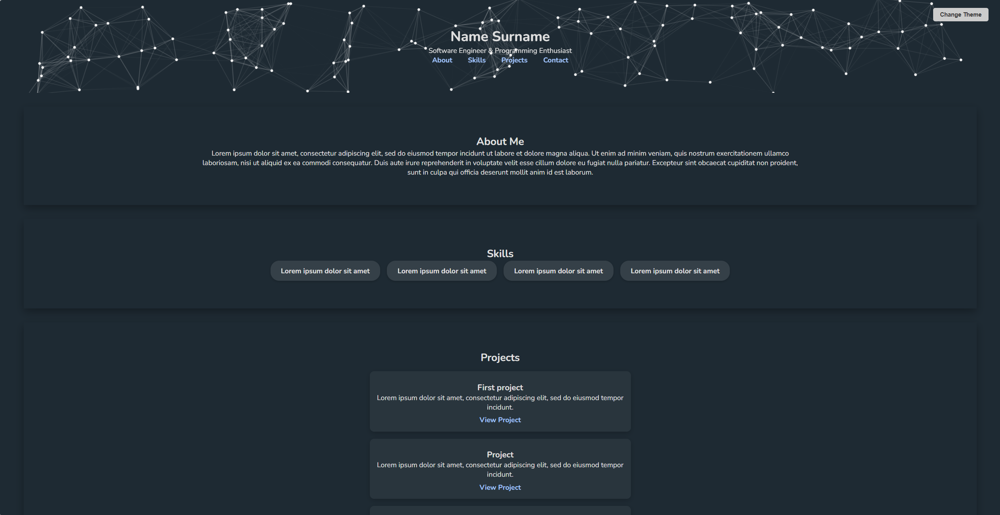
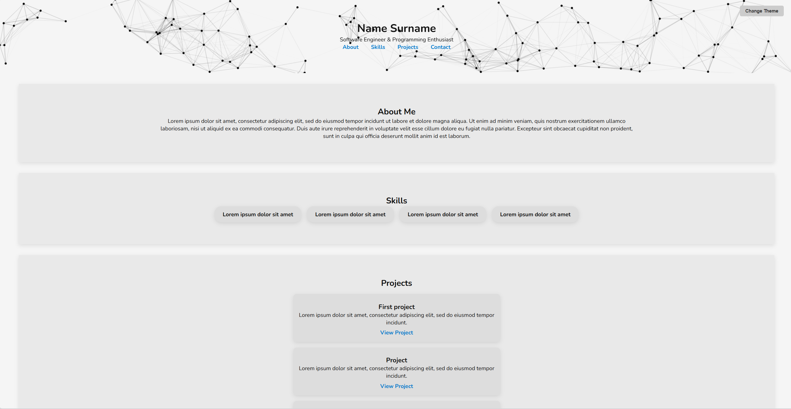
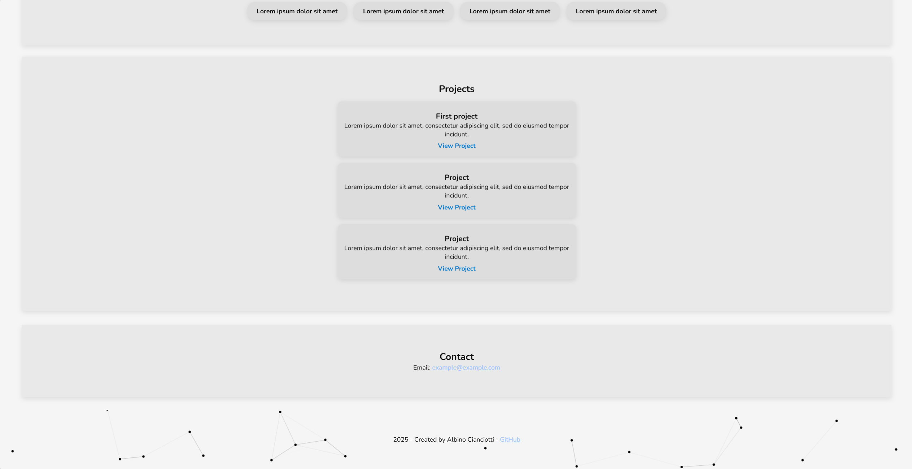

## :memo: Introduction - Why This Template

This responsive portfolio template (built with HTML, CSS, and particles.js) is designed to be easy to use, highly customizable, and ready to showcase your personal brand.

It’s perfect for both developers and non-developers who want to publish a clean, professional portfolio without dealing with frameworks or complex build setups.

## 🎯 Key Benefits to Highlight

**1.Simplicity & Ease of Use**

Just download template_portfolio.html, edit your name, bio, and links — and you’re good to go.

No frameworks or build tools required.

**2.Responsive & Modern Design**

Fully responsive layout for desktop and mobile.

Comes with both light and dark mode already set up.

**3.Dynamic Background with particles.js**

Clean and subtle animated background using particles.js, giving your site a modern look without being distracting.

Link to [particles.js](https://github.com/VincentGarreau/particles.js)

**4.Highly Customizable**

Easily change fonts, colors, and layout.

Add or remove sections like Projects, Skills, About Me, and Contact.

## 🧩 “How to Use” – Quick Start Guide

1. Clone or download the repo: `git clone https://github.com/albino98/portfolio-website.git`
2. Open `template_portfolio.html` in your editor
3. Replace the placeholder text (name, bio, links) with your content
4. (Optional) Tweak the CSS for fonts, colors, or layout
5. Customize sections like projects, skills, and contact
6. Deploy anywhere — GitHub Pages, Netlify, Vercel, etc.

## 🖼️ Screenshots

### Light theme

## Support

If you find it useful, give it a ⭐ !

Feel free to fork it or open issues for feedback and suggestions.

## License

This project is distributed under [MIT](LICENSE) license.

### Third-Party Dependencies

- [particles.js](https://github.com/VincentGarreau/particles.js) is used for the particle animated background.
  - License: MIT
  - Author: Vincent Garreau
